# NotebookLM — RAG-Powered Document Q&A

A full RAG pipeline application. Upload a PDF or text file, ask questions, get answers grounded in the document's actual content — not hallucinated.

---

## Architecture

```mermaid
flowchart LR
    %% Nodes
    A["📄 Upload\nPDF / TXT"] --> B["🔧 API: /api/upload"]
    B --> C["📝 DocumentProcessor\nExtract Text + Chunk\n4000 chars / 200 overlap"]

    C --> D["🔢 Embedding\nVertex AI text-embedding-004\n768-dim, batch=3"]

    D --> E["💾 Qdrant Cloud\nCollection: notebook-lm-docs\nCosine similarity"]

    E --> F["❓ User Query"]
    F --> G["🔍 API: /api/chat"]
    G --> H["🔎 Semantic Search\nTop-5 chunks retrieved"]

    H --> I["🧠 Gemini-2.5-flash\nVertex AI REST\nContext-grounded answer"]

    I --> J["✨ UI\nChat bubbles\nSource cards"]

    %% Styling
    classDef upload fill:#FF6B6B,stroke:#C92A2A,stroke-width:2px,color:#fff,font-weight:bold
    classDef api fill:#4ECDC4,stroke:#0E9F8E,stroke-width:2px,color:#fff,font-weight:bold
    classDef process fill:#A855F7,stroke:#7E22CE,stroke-width:2px,color:#fff,font-weight:bold
    classDef embed fill:#3B82F6,stroke:#1D4ED8,stroke-width:2px,color:#fff,font-weight:bold
    classDef vector fill:#06B6D4,stroke:#0891B2,stroke-width:2px,color:#fff,font-weight:bold
    classDef query fill:#F59E0B,stroke:#D97706,stroke-width:2px,color:#fff,font-weight:bold
    classDef llm fill:#10B981,stroke:#059669,stroke-width:2px,color:#fff,font-weight:bold
    classDef ui fill:#EC4899,stroke:#BE185D,stroke-width:2px,color:#fff,font-weight:bold

    class A upload
    class B,G api
    class C,H query
    class D embed
    class E vector
    class I llm
    class J ui
```



**Pipeline flow:**

```mermaid
sequenceDiagram
    participant U as User
    participant FE as Frontend
    participant API as /api/upload
    participant DP as DocumentProcessor
    participant VS as VectorStore
    participant Q as Qdrant

    U->>FE: Upload PDF/TXT
    FE->>API: POST multipart/form-data
    API->>DP: processFile(buffer, name, type)
    DP->>DP: Extract text (pdf-parse / TextDecoder)
    DP->>DP: Chunk: RecursiveCharacterTextSplitter
    DP-->>VS: Document[]
    VS->>VS: Embed via Vertex AI text-embedding-004
    VS->>Q: upsert notebook-lm-docs
    Q-->>VS: done
    FE-->>API: { success, chunksCreated }

    Note over U,Q: Query Phase
    U->>FE: Ask question
    FE->>API: POST /api/chat { query }
    API->>VS: retrieve(query, k=5)
    VS->>VS: Embed query (RETRIEVAL_QUERY)
    VS->>Q: semantic search
    Q-->>VS: top-5 chunks
    VS-->>API: context chunks
    API->>API: Build prompt with context
    API->>API: Gemini-2.5-flash generateContent
    FE<<--API: { answer, sources }
    U<<--FE: Display answer + source cards
```

---

## RAG Pipeline

### 1. Ingestion — `src/app/api/upload/route.ts`

1. File received as `multipart/form-data`
2. `DocumentProcessorAdapter.processFile()` — extract + chunk
3. Chunks embedded via Vertex AI `text-embedding-004`
4. Points upserted to Qdrant Cloud (`wait: true`)

### 2. Chunking — `src/lib/adapters/document-processor-adapter.ts`

**Recursive Character Text Splitter** — hierarchical separators preserve semantic coherence.

| Parameter      | Value                           | Rationale                                                    |
| -------------- | ------------------------------- | ------------------------------------------------------------ |
| `chunkSize`    | 4000 chars                      | Fits within Gemini context; preserves paragraph-scale chunks |
| `chunkOverlap` | 200 chars                       | Context bleeds across chunk boundaries                       |
| `separators`   | `["\n\n", "\n", ". ", " ", ""]` | Paragraph → sentence → word → character                      |

**Why this strategy:**

- Paragraph boundaries (`\n\n`) take priority, keeping related sentences together
- Sentence boundary (`. `) used as fallback, preserving grammatical units
- Overlap of 200 chars ensures no information loss at chunk edges
- Page numbers extracted via regex `Page (\d+)` when present in PDF text

### 3. Embedding — `src/lib/adapters/qdrant-vector-store-adapter.ts`

- **Model**: `text-embedding-004` via Vertex AI
- **Dimension**: 768
- **Task type**: `RETRIEVAL_DOCUMENT` (for stored chunks), `RETRIEVAL_QUERY` (for queries)
- **Batch size**: 3 (rate-limit friendly)
- **Text truncation**: 3000 chars before embedding (model limit)

### 4. Storage

- **Qdrant Cloud** (managed, `notebook-lm-docs` collection)
- **Distance metric**: Cosine similarity
- **Point IDs**: UUIDs (randomly generated per chunk)
- **Payload**: `{ content, source, pageNumber, fileType }`
- **Mode**: Accumulating — all uploads appended to same collection, tagged by `source` filename

### 5. Retrieval

- Query embedded with `RETRIEVAL_QUERY` task type
- Top-5 chunks retrieved via cosine similarity
- Returns `{ pageContent, source, pageNumber }` per chunk

### 6. Generation — `src/app/api/chat/route.ts`

- Retrieved chunks injected into prompt as `[Source N]: content`
- Rules: answer only from context, cite sources, refuse if not found
- **Model**: Gemini-2.5-flash via Vertex AI REST API (Ditto pattern)
- **Temperature**: 0.4 · **maxOutputTokens**: 4096
- **Safety**: `BLOCK_ONLY_HIGH` for all categories

---

## Tech Stack

| Layer            | Technology                                                     |
| ---------------- | -------------------------------------------------------------- |
| Frontend         | Next.js 16 (App Router) · TypeScript · Tailwind CSS · React 19 |
| Backend          | Next.js API Routes                                             |
| Embedding        | Vertex AI `text-embedding-004` (768-dim)                       |
| LLM              | Gemini-2.5-flash via Vertex AI                                 |
| Vector DB        | Qdrant Cloud (managed)                                         |
| Auth             | Google Auth Library (service account, `gcp.json`)              |
| Document parsing | `pdf-parse` (PDF), `TextDecoder` (TXT)                         |
| Text splitting   | LangChain `RecursiveCharacterTextSplitter`                     |

---

## Setup

### Prerequisites

- Node.js ≥20
- Google Cloud account with Vertex AI API enabled
- Qdrant Cloud account (free tier works)
- GCP service account with roles: `roles/aiplatform.user`, `roles/monitoring.viewer`

### 1. Environment Variables (`.env`)

```env
QDRANT_URL=https://your-cluster.qdrant.cloud
QDRANT_API_KEY=your_qdrant_api_key
```

Service account key: place `gcp.json` in project root (never commit this file).

### 2. Create Qdrant Collection

```bash
curl -X PUT \
  -H "Content-Type: application/json" \
  -H "api-key: YOUR_QDRANT_API_KEY" \
  -d '{"vectors": {"size": 768, "distance": "Cosine"}}' \
  "YOUR_QDRANT_URL/collections/notebook-lm-docs"
```

### 3. Run Locally

```bash
cd NotebookLM
pnpm install
pnpm dev
# Open http://localhost:3000
```

### 4. Deploy to Vercel

```bash
pnpm vercel
```

Set `QDRANT_URL` and `QDRANT_API_KEY` in Vercel dashboard env vars. Upload `gcp.json` via `vercel env add` or `vercel secrets`.

---

## Project Structure

```
NotebookLM/
├── src/
│   ├── app/
│   │   ├── api/
│   │   │   ├── upload/route.ts       ← ingestion pipeline
│   │   │   └── chat/route.ts         ← RAG query pipeline
│   │   ├── page.tsx                  ← UI (UploadZone + ChatInterface)
│   │   └── layout.tsx
│   ├── components/chat/
│   │   ├── AssistantMessage.tsx       ← assistant bubble + sources
│   │   ├── UserMessage.tsx            ← user bubble
│   │   ├── LoadingState.tsx           ← animated dots
│   │   └── SourceCard.tsx             ← expandable source card
│   ├── hooks/
│   │   └── useChat.ts                 ← chat state management
│   ├── lib/
│   │   ├── adapters/
│   │   │   ├── document-processor-adapter.ts   ← PDF/TXT + chunking
│   │   │   └── qdrant-vector-store-adapter.ts  ← vector ops + embedding
│   │   ├── ports/
│   │   │   ├── document-processor-port.ts       ← interface
│   │   │   └── vector-store-port.ts             ← interface
│   │   └── container.ts              ← dependency injection (singleton)
│   └── types/
│       └── index.ts
├── gcp.json                           ← GCP service account (not committed)
├── .env                               ← Qdrant credentials
└── next.config.ts
```

---

## API Reference

### `POST /api/upload`

Upload a document for indexing.

**Request:** `multipart/form-data` with `file` field (PDF or TXT)

**Response:**

```json
{
  "success": true,
  "fileName": "document.pdf",
  "chunksCreated": 5
}
```

### `POST /api/chat`

Query indexed documents.

**Request:**

```json
{ "query": "What is the main argument?" }
```

**Response:**

```json
{
  "answer": "According to the document...",
  "sources": [{ "pageContent": "...", "source": "document.pdf", "pageNumber": 3 }]
}
```

---

## SOLID Principles

| Principle                   | Implementation                                                                                             |
| --------------------------- | ---------------------------------------------------------------------------------------------------------- |
| **S** Single Responsibility | `useChat.ts` — state only; `SourceCard.tsx` — card only; `AssistantMessage.tsx` — bubble only              |
| **O** Open/Closed           | New message type → new component; `SourceCard` used inside `AssistantMessage` via import, parent unchanged |
| **L** Liskov Substitution   | All message components accept same `formatTimestamp` prop — fully substitutable                            |
| **I** Interface Segregation | `SourceCardProps` has 5 fields; `ChatInterfaceProps` has 4 — no fat interfaces                             |
| **D** Dependency Inversion  | `page.tsx` depends on hook + component interfaces, not concrete implementations                            |

---

## FAQ

**Q: Does uploading a new file overwrite previous uploads?**
No. All documents accumulate in the same Qdrant collection. Each chunk is tagged by `source` filename. Queries retrieve relevant chunks across all indexed documents, ranked by cosine similarity.

**Q: What if no relevant chunks are found?**
Returns: _"I could not find relevant information in the uploaded document. Please try rephrasing or ask about content that appears in the document."_

**Q: Why raw REST fetch instead of Vertex AI SDK?**
The `@google-cloud/vertexai` SDK was deprecated June 2025 and requires specific resource name formats. The REST pattern (same as the Ditto project) is stable and explicit.

**Q: Why Gemini-2.5-flash?**
Flash is fast and cost-efficient. For document Q&A with grounded answers, response quality matters more than raw model size.

**Q: What's the embedding dimension?**
768 — from `text-embedding-004`. Qdrant collection must be created with `{"vectors": {"size": 768, "distance": "Cosine"}}`.

---

## License

MIT
